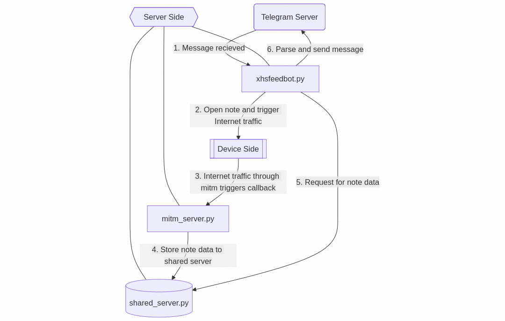

# xhsfeedbot


A bot that forward REDNote to Telegram Message or Telegraph

[](https://www.python.org/)

[](https://pypi.org/project/mitmproxy/)
[](https://pypi.org/project/python-telegram-bot/)
[](https://pypi.org/project/telegraph/)
[](https://pypi.org/project/Flask/)
[](https://pypi.org/project/pytz/)
[](https://pypi.org/project/python-dotenv/)
[](https://pypi.org/project/requests/)
[](https://www.paramiko.org/)

[](https://t.me/xhsfeedbot)

## Requirements

1. Server side: Python 3.13 or newer on Linux, macOS or Windows.

2. Device side: A rooted Android device or emulator, or jailbroken iOS device, with REDNote app installed.

3. Both server and device must be in the same network, and server side should has stable access to Telegram and Telegraph server.

## How it works


## Deployment guide

### Server side
Download [platform-tools](https://developer.android.com/tools/releases/platform-tools) and add `adb` to `PATH` if you are using an Android device.

```bash
git clone https://github.com/francgossin/xhsfeedbot.git
cd xhsfeedbot
mkdir -p data
mkdir -p log
python3.13 -m venv .venv
```
Create a `.env` file with your own configuration.
```python
BOT_TOKEN='Telegram Bot Token'
ADMIN_ID='Bot Owner Telegram ID'

# 0: Android with root; 1: Jailbroken iOS
TARGET_DEVICE_TYPE=1

# ssh information necessary if your target device type is jailbroken iOS
SSH_IP=127.0.0.1 # device IP address
SSH_PORT=22 # device ssh port, defaut 22
SSH_USERNAME=root
SSH_PASSWORD=alpine
# Default user name and password for jailbroken iOS. You may have to configure your own.

WHITELIST_ENABLED=true
```

If you want to enable whitelist, create a `whitelist.json` file.

```
{
  "users": [
    101010101,
    010101010
  ]
}
```

Open three terminal windows or use `screen`, start all three scripts.
```bash
# export https_proxy when necessary.
python xhsfeedbot.py
```

```bash
python mitm_server.py
```

```bash
python shared_server.py
```
### Device side

Start `mitm_server.py` and set device proxy on Wi-Fi settings.

Host: server side IP address.

Port: mitm server's port number.

Open [mitm.it](http://mitm.it) on device browser and follow the corresponding guide.

#### iOS devices

Check [ios.cfw.guide](https://ios.cfw.guide/) to jailbreak your iOS device. 

Then install `OpenSSH` through APT package manager for jailbroken iOS like Cydia or Sileo.

#### Android devices
Guide of [Android Emulator](https://docs.mitmproxy.org/stable/howto/install-system-trusted-ca-android/)

If you are not using an emulator, you need to root your device and then manually move CA certificate to system partition, or use [Magisk](https://docs.mitmproxy.org/stable/howto/install-system-trusted-ca-android/#instructions-when-using-magisk) method, and then reboot.